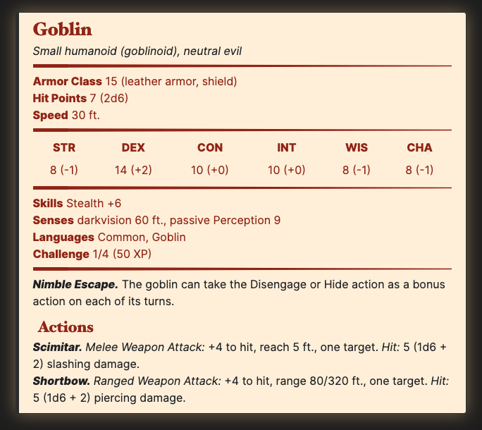

# Obsidian Stat Block CSS

This is a [CSS snippet](https://publish.obsidian.md/help/How+to/Add+custom+styles) for [Obsidian](https://obsidian.md) to style stat blocks
for Dungeons and Dragons.

```markdown
---
cssclasses: stat-block
---
> ## Goblin
>*Small humanoid (goblinoid), neutral evil*
>___
> - **Armor Class** 15 (leather armor, shield)
> - **Hit Points** 7 (2d6)
> - **Speed** 30 ft.
>___
>|STR|DEX|CON|INT|WIS|CHA|
>|:---:|:---:|:---:|:---:|:---:|:---:|
>|8 (-1)|14 (+2)|10 (+0)|10 (+0)|8 (-1)|8 (-1)|
>___
> - **Skills** Stealth +6
> - **Senses** darkvision 60 ft., passive Perception 9
> - **Languages** Common, Goblin
> - **Challenge** 1/4 (50 XP)
>___
> ***Nimble Escape.*** The goblin can take the Disengage or Hide action as a bonus action on each of its turns.
> ### Actions
> ***Scimitar.*** _Melee Weapon Attack:_ +4 to hit, reach 5 ft., one target. _Hit:_ 5 (1d6 + 2) slashing damage.
>
> ***Shortbow.*** _Ranged Weapon Attack:_ +4 to hit, range 80/320 ft., one target. _Hit:_ 5 (1d6 + 2) piercing damage.
```

Becomes:



## Install

* In Obsidian, open Preferences, Appearance, then open the folder for CSS
Snippets.
* Download `stat-block.css` to that folder.
* Enable `stat-block.css` in CSS Snippets in Obsidian.

## Usage

The CSS is designed to work with the stat blocks from [Tetra-cube's DND 5e
Statblock Generator](https://tetra-cube.com/dnd/dnd-statblock.html). Use that
page to create your stat block,then press the "View Markdown" button to get the
markdown for Obsidian.

Be sure to tag the page with a stat block with:

```markdown
---
cssclasses: stat-block
---
```

If you want to use a stat block on a page with more information, you may want to
[transclude the note](https://publish.obsidian.md/help/How+to/Embed+files#Embed+notes)
into your main note:

`![[Goblin]]`

